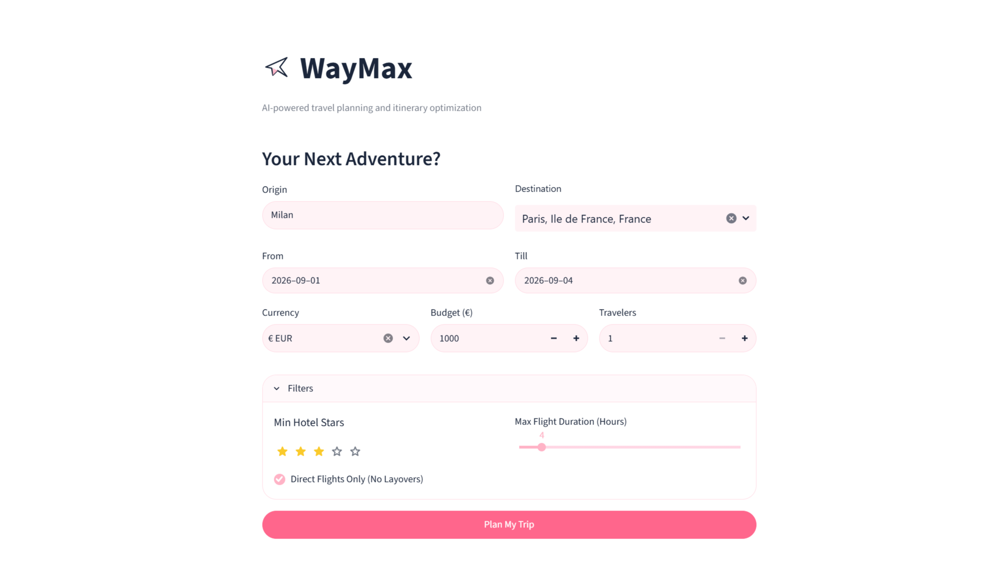
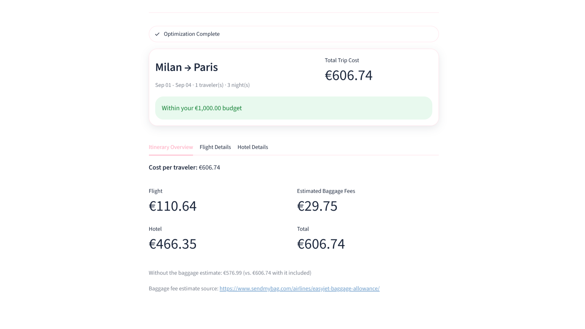
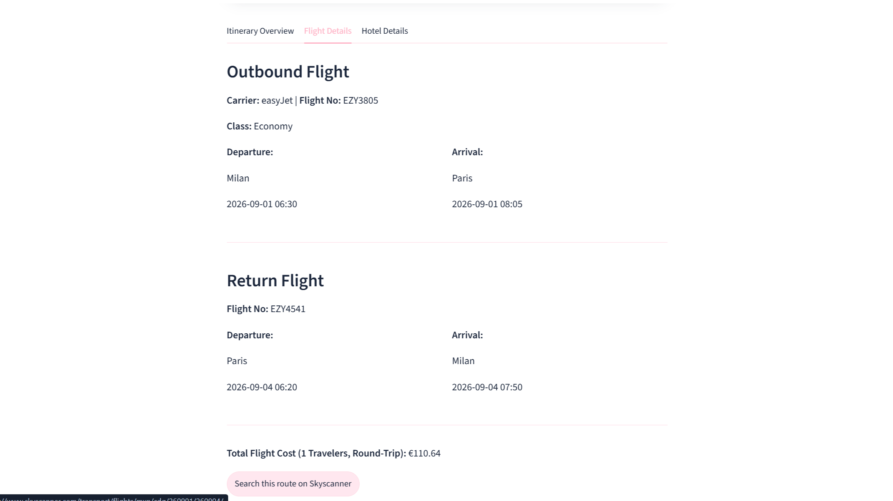
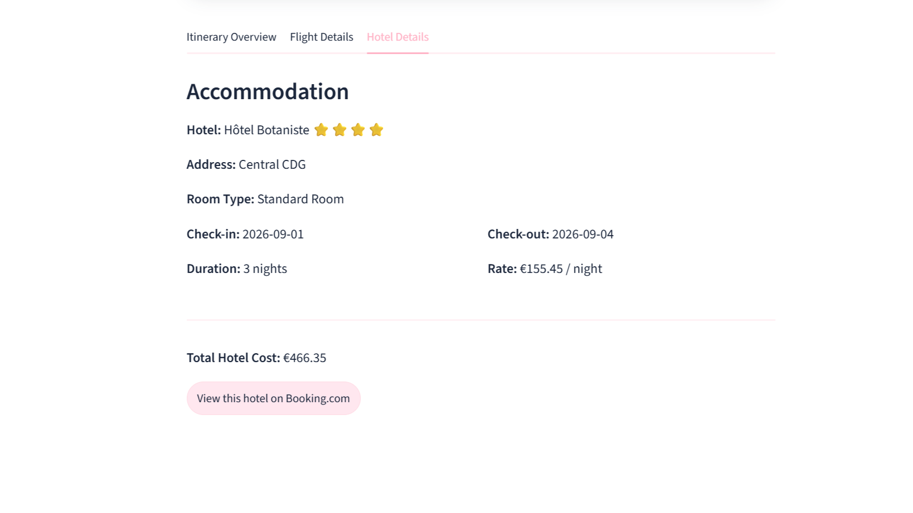

# WayMax

A multi-agent travel planner that turns a natural-language trip request into a
priced, budget-fitting flight + hotel itinerary — sourced from live flight and
hotel APIs, cost-adjusted with a retrieval-augmented estimate of hidden fees,
and solved with an exact optimizer rather than a single LLM guess.

It's built as a small case study in dividing an "AI travel agent" into
narrow, single-responsibility agents — the kind of decomposition a real
production system would use instead of asking one large model to parse
intent, call APIs, and do budget math all in the same prompt.

## Demo

[**Watch the full demo on YouTube**](https://youtu.be/0Mzt3L8Ieqc) — a live walkthrough of the app end to end.

A real search (Milan → Paris) run against live flight and hotel data.

| | |
|---|---|
|  |  |
| The search form, with the destination resolved via a live Booking.com Autocomplete lookup and filters (min stars, direct-only, max duration) collapsed by default. | The trip summary card plus the Itinerary Overview tab — cost broken down by flight/hotel/baggage, the total shown both with and without the RAG-estimated baggage fee, and a link to the exact source document that fee came from. |
|  |  |
| Outbound/return flight detail, with a constructed link to search that same route on Skyscanner. | Hotel detail, with a constructed link straight to that property's Booking.com page. |

## Architecture

A [LangGraph](https://github.com/langchain-ai/langgraph) `StateGraph` runs
four nodes in a fixed pipeline, each with one job and one exit condition:

```
supervisor --(destination found)--> sourcing --> rag --> optimization --> END
     \--(no destination extracted)--> END
```

| Node | File | Responsibility |
|---|---|---|
| **Supervisor** | [`src/agents/supervisor.py`](src/agents/supervisor.py) | The only node that reads conversation history. Uses Gemini 2.5 Flash with structured output to extract origin/destination **IATA airport codes**, dates, budget, and traveler count from free text. Routes to `sourcing` only if a destination was found. |
| **Sourcing** | [`src/agents/sourcing.py`](src/agents/sourcing.py) | Pure data retrieval — never converses, never guesses. Calls the Skyscanner flights API and the Booking.com hotels API in parallel, filtered by the user's direct-flight/star-rating/duration preferences. Any API failure degrades to an empty list rather than raising, so a flaky provider can't crash the whole run. |
| **RAG** | [`src/agents/rag.py`](src/agents/rag.py) | Enriches each sourced flight with a checked-baggage-fee estimate — plus the source document it came from — retrieved from a local [Chroma](https://www.trychroma.com/) vector store of airline baggage policies (embedded with `sentence-transformers`). This is what lets the optimizer account for costs that never appear in a flight-search API response. A configurable distance threshold (`config.rag.max_match_distance`) rejects vector-search matches that are too dissimilar rather than confidently returning the nearest airline's policy regardless of fit — without it, an airline outside the (currently 3-airline) knowledge base would silently inherit an unrelated one's fees. |
| **Optimizer** | [`src/agents/optimization.py`](src/agents/optimization.py) | Deterministic brute-force search over every (flight × hotel) pair to find the true-cheapest combination — hotel cost scaled by nights and rooms-needed, baggage cost scaled by traveler count — that fits the budget. Falls back to the single cheapest flight + hotel (flagged `within_budget: False`) if nothing fits, rather than returning nothing. |

### Transparency over the numbers shown

Every price WayMax reports falls into one of three categories, and the UI is
explicit about which is which rather than presenting one blended total:

- **Live-sourced facts** — flight and hotel prices come directly from
  Skyscanner/Booking.com's own API responses at query time; WayMax filters
  and formats them but never generates them.
- **Provably correct computation** — given that sourced data, the optimizer
  is an exhaustive search, not a heuristic or model guess, so it's
  mathematically guaranteed to find the true cheapest valid combination
  (verified by unit tests with hand-computed expected totals).
- **A labeled estimate** — the RAG-retrieved baggage fee is the one number
  in the system that isn't a live quote. The UI shows the total both with
  and without it, links to the exact source document the estimate was
  drawn from, and says so explicitly when no policy was found for an
  airline (rather than implying `0.00` means baggage is free).

Sourcing/RAG API failures are also distinguished from genuine empty results:
`sourcing_errors` in `WaymaxState` is populated only when a data source
actually failed (network error, non-2xx response), never when a search
legitimately found nothing — so the UI can tell a user "we couldn't reach a
provider" apart from "there's really nothing available," instead of
collapsing both into the same generic message.

Flight and hotel results also link out to a live Skyscanner search (same
route/dates) and the specific hotel's Booking.com page, respectively —
neither API returns a direct deep link to the exact result shown, so these
are constructed rather than extracted, and the UI says so.

Every node is a plain function over a dict (`WaymaxState`), so each is
independently callable and testable without going through the graph — see
[`tests/`](tests/) for examples that exercise nodes directly with mocked API
responses.

### Why hotel destination resolution isn't a text-guessing problem

Booking.com's hotel-search API needs an internal `dest_id`, not a city name —
and city names are frequently ambiguous ("Valencia" — Spain or Venezuela?
"Cambridge" — UK or Massachusetts?). Rather than having an LLM or a fuzzy
cache guess which one the user meant, the Streamlit UI queries Booking.com's
own Autocomplete endpoint live as the user types and lets them pick the exact
match — so the `dest_id` used downstream is always correct, never inferred.

## Repo structure

```
WayMax/
├── src/
│   ├── main.py                   # Builds and compiles the LangGraph StateGraph
│   ├── state.py                  # WaymaxState - the schema every node reads/writes
│   ├── config.py                 # Typed loader for config/config.yaml
│   ├── metrics.py                # Per-run instrumentation (RunMetrics)
│   ├── logging_config.py         # Central logging setup (WAYMAX_LOG_LEVEL)
│   ├── agents/
│   │   ├── supervisor.py         # LLM-based constraint extraction
│   │   ├── sourcing.py           # Live flight/hotel API calls
│   │   ├── rag.py                # Baggage-fee enrichment
│   │   └── optimization.py       # Exhaustive cheapest-combination search
│   ├── rag/
│   │   ├── knowledge_base.py     # Builds/persists the Chroma vector store
│   │   ├── retriever.py          # Query interface + match-distance filtering
│   │   └── documents/
│   │       └── baggage_fees.py   # Seed baggage-policy documents
│   └── ui/
│       └── app.py                # Streamlit front end
├── scripts/
│   └── metrics_report.py         # Aggregates outputs/metrics/*.json into a report
├── tests/                        # One test file per src/ module, offline/mocked
├── config/
│   └── config.yaml               # Non-secret tunables (hosts, timeouts, UI defaults)
├── .streamlit/
│   └── config.toml               # Theme (light/dark palette), server settings
└── outputs/metrics/              # RunMetrics JSON, one file per graph invocation
```

## Shared state

All four nodes read and write a single `TypedDict` — see
[`src/state.py`](src/state.py) for the authoritative schema. The important
fields:

- `origin`, `destination` — IATA airport codes, extracted by the supervisor
- `destination_city`, `hotel_dest_id` — resolved once by the UI's live search box, used directly by hotel sourcing
- `max_budget`, `travel_dates`, `travelers`, `min_hotel_stars`, `direct_only`, `max_flight_hours` — user constraints
- `raw_flight_data`, `raw_hotel_data` — sourced results (flights gain `baggage_fee_estimate`/`baggage_fee_source_url` after the RAG node runs; both also carry a constructed `search_link`/`booking_link`)
- `sourcing_errors` — human-readable notes when a sourcing/RAG API call actually failed, distinct from a search that genuinely returned zero results
- `final_itinerary` — the optimizer's chosen flight + hotel pair, with a full cost breakdown

## Observability

Every graph invocation writes a JSON metrics file to `outputs/metrics/`
(see [`src/metrics.py`](src/metrics.py)) capturing per-node wall-clock
timing, LLM token usage, the outcome of every external API call (including
cache hits vs. live lookups), and optimizer quality (combinations evaluated,
best price found, whether it landed within budget). This is meant to make
future performance/cost work measurable rather than guessed at.

[`scripts/metrics_report.py`](scripts/metrics_report.py) aggregates every
file in `outputs/metrics/` into a single report — per-node latency
(avg/p50/p95), total LLM token usage, per-endpoint API failure and
cache-hit rates, and the fraction of runs whose itinerary landed within
budget:

```bash
python scripts/metrics_report.py
```

Run this after a handful of real invocations (via `python -m src.main` or
the Streamlit UI) to see where pipeline time is actually going — in
practice, the RAG node's embedding lookup has been the dominant cost.

## Installation

```bash
git clone https://github.com/<your-username>/waymax.git
cd waymax
pip install -e .[dev]
```

This installs WayMax and its runtime dependencies (LangGraph, LangChain,
Streamlit, ChromaDB, sentence-transformers, etc.) plus the `dev` extra
(`pytest`, `responses`) needed to run the test suite.

**Windows note:** `torch` (a `sentence-transformers` dependency, used by the
RAG node) requires the
[Microsoft Visual C++ Redistributable (x64)](https://aka.ms/vs/17/release/vc_redist.x64.exe)
to load correctly. Without it, RAG lookups fail with a DLL error and the RAG
node degrades gracefully to a `0.0` baggage estimate — the pipeline still
runs, but baggage costs won't be reflected.

## Configuration

Non-secret tunables (LLM model name, API hosts/timeouts, result caps, UI
defaults, etc.) live in [`config/config.yaml`](config/config.yaml) and are
loaded through [`src/config.py`](src/config.py). Secrets go in a `.env` file
at the repo root (not committed):

```
GOOGLE_API_KEY=your-google-api-key
Sky_Scanner_Key=your-rapidapi-key
```

## Running

```bash
# Run the LangGraph pipeline against a hardcoded test trip
python -m src.main

# Run the Streamlit UI
streamlit run src/ui/app.py
```

## Testing

```bash
pytest tests/ -v
```

All tests run offline against mocked API/LLM responses — no API keys
required, no live network calls. The RAG test suite builds a real (tiny)
Chroma collection with the real local embedding model rather than mocking
retrieval, since a mocked embedding function can't validate that semantic
search actually works; it skips cleanly (not a failure) if `torch` can't
load, per the Windows note above.
